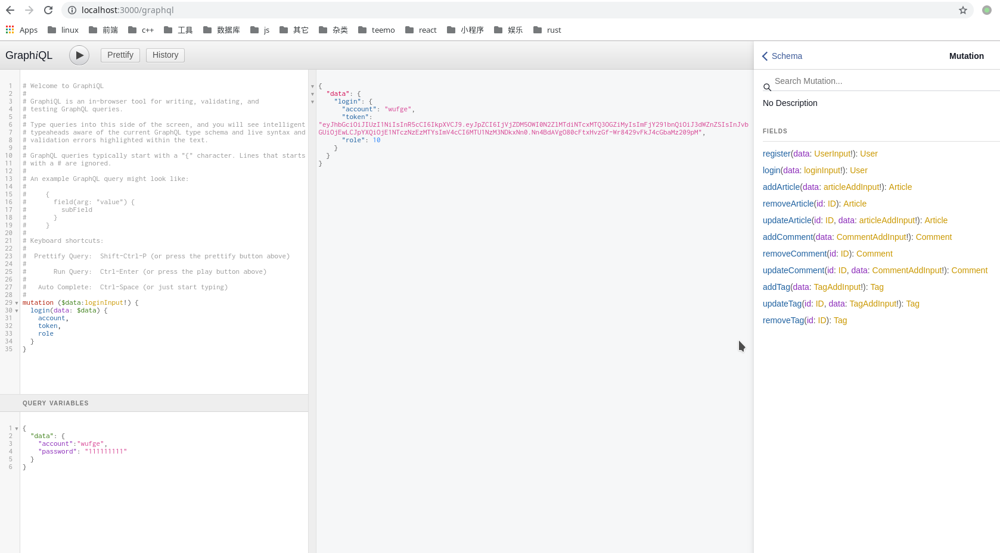

### 说明
这个项目是大概一年半前为了玩下graphql而写的node, 技术栈基于koa,graphql,mongoose, jwt不过也写了rest形式的api；nodemon来管理本地开发的文件变化重启服务等，同时也配了vscode的debugger;后面考虑服务器磁盘小　便想把它打包之后直接将打包之后的js（压缩混淆之后1.94M左右）丢服务器来部署, 所以简单配了webpack；尝试了几波pm2来管理node服务，最终arch上貌似用这个有些问题, 后面想用systemctl来管理，找到了阮一峰老师写的博客　复制下来改改，　这种模式也挺好的 起个.socket 服务来唤醒.service服务；然后在代码定时，超时不用的退出，关闭服务；后面想到用个fast_cgi，但感觉没啥用，而且感觉一个node服务占不了多少资源，没必要这样，

\# node-socket-server.service
```
[Unit]
Description=node server

[Service]
ExecStart=/usr/bin/node /opt/node/test/socketApp.js
Restart=always
User=weigu
Group=weigu
Environment=PATH=/usr/bin:/usr/local/bin
Environment=NODE_ENV=production
WorkingDirectory=/opt/node/test
```


\# node-socket-server.socket
```
[Socket]
ListenStream=3000

[Install]
WantedBy=sockets.target
```



通过.socket 配合systemctl 来按需启多个服务，通过nginx来配一层负载均衡器
```
 upstream test{ 
    server 0.0.0.0:6666 weight=1; 
    server 0.0.0.0:5555 weight=2;
    server 0.0.0.0:8888 backup;
}
```